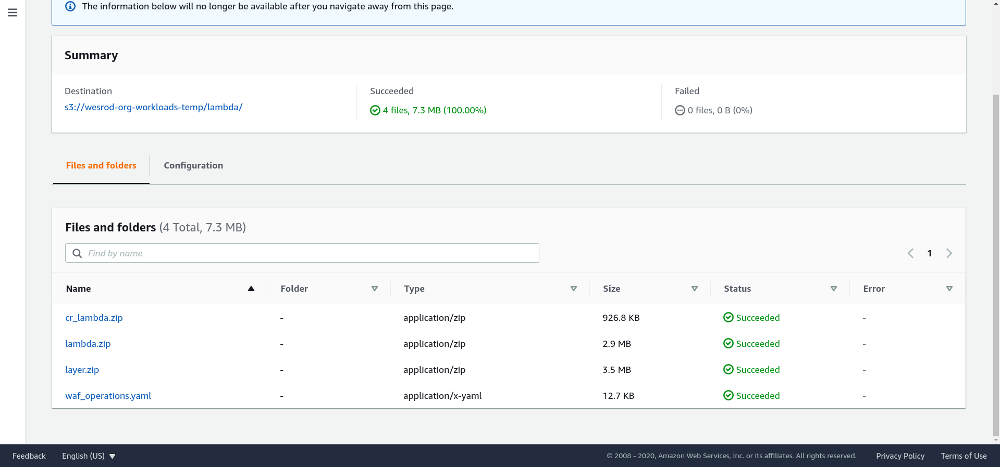

# AWS WAF OPERATIONS

#### Construa dashboards operacionais no Elasticsearch para operação do AWS WAF

Neste repositório, compartilhamos código python para adaptação dos logs do AWS WAF (usando o lambda de transformação do Kinesis Firehose) e templates de dashboards para o Kibana.

A implementação está baseada neste blogpost, atualizando a versão do ES para 7:
https://aws.amazon.com/pt/blogs/security/how-to-analyze-aws-waf-logs-using-amazon-elasticsearch-service/

### Instalação

Para fazer a instalação, precisamos criar um bucket no S3 e salvar os arquivos .ZIP contendo as funções Lambda. Clone o repositório (com o comando `git clone git@github.com:danidoo/aws-waf-operations.git`) ou efetue o download dos arquivos `waf_operations.yaml, lambda.zip e cr_lambda.zip` . Crie um bucket S3 na conta onde o deploy da solução será executado, crie uma pasta para organizar os arquivos e faça o upload:

Depois de fazer o upload dos arquivos, abra a console do CloudFormation, clique em Create Stack e coloque a URL do arquivo yaml que acabamos de salvar no S3:

Na próxima tela, defina um nome para a stack e preencha os parâmetros obrigatórios (Bucket, BucketKey e E-mail):

Na última tela, autorize o CloudFormation a criar recursos do IAM:

O próximo passo deve demorar de 30 a 40 minutos:

Durante o processo, você deve receber um e-mail com credenciais temporárias:

Quando o processo de deploy for concluído, podemos acessar o dashboard do Kibana através da URL do ElasticSearch + o sulfixo /_plugin/kibana. A URL do ES pode ser encontrada na aba Outputs:

A tela do Cognito será exibida. Utilize as credenciais enviadas no e-maill:

Ao abrir os dashboards, você perceberá que eles estão sem dados. Para começar a contagem, acesse o WAF, ative os logs e direcione a saída para o Kinesis Firehose. Assim que os requests chegarem, as métricas começarão a ser preenchidas:

E este é o Dashboard com dados:

### Desinstalação

Para remover a solução, basta deletar a stack via CloudFormation.